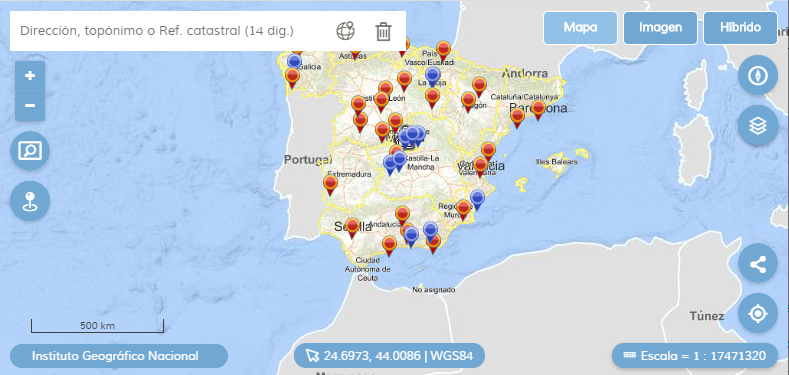

# 🔌 M.plugin.Arquetipo para API-CNIG

El propósito de este desarrollo es crear un plugin que sirva como prototipo para crear nuevos plugins para la **APICNIG 3.0**. Si bien mediante paquetes **npm** puede lanzarse un asistente para crear una estructura básica sobre la que podamos crear plugins, el ejemplo es muy escaso y tiene problemas de funcionamiento, además de que, al emnos para mí, carece de una explicación adecuada de los métodos y eventos necesarios para comprender la mecánica de funcionamiento.


---

## 🚀 Cómo crear un arquetipo de plugin para **Mapea Core** y para **API-CNIG**

Voy a crear un proyecto arquetipo de plugin que sirva de base para crear los nuevos plugins. Navegamos al directorio de trabajo, en mi caso

```none
C:\ms4w\Apache\htdocs\apicnig
```
y en esta ubicación ejecutamos, para el usar el Mapea Core.

```bash
$ npm install -g mapea-create-plugin
$ mapea-create-plugin
# Lo hacemos con la versión 5.2
# Dejamos que se instalen las dependencias npm. También podríamos instalarlas luego con un npm install
$ npm start
```

Para instalar el arquetipo que utiliza API-CNIG usamos

```bash
$ npm install -g api-cnig-create-plugin  # Con esto instalamos nuestra herramienta de creación de plugin
$ api-cnig-create-plugin                 # Así creamos un proyecto base para desarrollar nuestro plugin
```

Tras realizar el **npm install** y si se encuentran vulnerabilidades, podemos ver cuales son con **npm audit** y podemos corregirlas con **npm audit fix**.

Otras funciones disponibles son

```bash
$ npm start           # Inicia entorno de desarrollo para depurar y probar
$ npm run check       # Podemos validar el código con ESLint 
$ npm run build       # Crea ficheros distribuibles del plugin para ser consumidos por nuestro visor
$ npm run test-build  # Entorno de producción para probar los ficheros creados con el comando anterior
```

## 📚 Recursos de consulta

* 💡 Guía en detalle del plugin **Arquetipo** 👉 [documents/e2molin.md](documents/emolin.md)
* 💡 Snippets de código **Arquetipo** 👉 [documents/snippets.md](documents/snippets.md)
* Manual de referencia API IGN [🔗 https://componentes.ign.es/api-core/doc/](https://componentes.ign.es/api-core/doc/)
* Visor básico [🔗 https://componentes.ign.es/api-core/visor.jsp](https://componentes.ign.es/api-core/visor.jsp)
* Repositorio en Github del APICORE [🔗 https://github.com/IGN-CNIG/API-CNIG](https://github.com/IGN-CNIG/API-CNIG)
* Repositorio en Github de los plugins [🔗 https://github.com/IGN-CNIG/API-CNIG/tree/master/api-ign-js/src/plugins](https://github.com/IGN-CNIG/API-CNIG/tree/master/api-ign-js/src/plugins)
* Wiki general de la API-CNIG [🔗 https://github.com/IGN-CNIG/API-CNIG/wiki](https://github.com/IGN-CNIG/API-CNIG/wiki)
* Guía de desarrollo de plugins [🔗 https://github.com/IGN-CNIG/API-CNIG/wiki/Gu%C3%ADa-de-desarrollo-de-plugins](https://github.com/IGN-CNIG/API-CNIG/wiki/Gu%C3%ADa-de-desarrollo-de-plugins)
* Página de test de los plugins [🏁 Producción](http://componentes.ign.es/api-core/test.html) [⚙ Desarrollo](https://mapea-lite.desarrollo.guadaltel.es/api-core/test.html)

## 🛠 Herramientas

* **Node.JS** version 8 o superior [🔗 https://nodejs.org/es/](https://nodejs.org/es/)
* **handlebars** [🔗 https://handlebarsjs.com/](https://handlebarsjs.com/)
* **IcoMoon** [🔗 https://icomoon.io/app/#/select](https://icomoon.io/app/#/select)
* **Fontello** [🔗 https://fontello.com/](https://fontello.com/)

