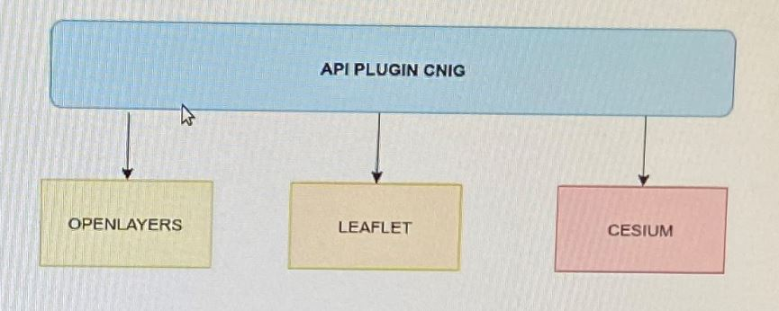
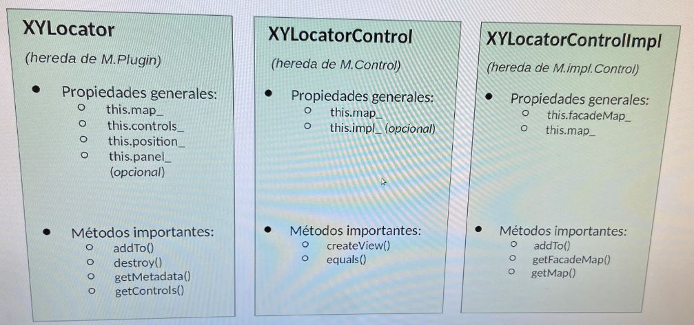

# API CNIG

## ⛲️ Referencias web

* Seguimiento del proyecto CNIG-GUADALTEL  [🔗 enlace](https://www.guadaltel.es/redmine/)
* Repositorio **Guadaltel** de API [🔗 enlace](https://www.guadaltel.es/redmine/projects/mapea-lite/repository/revisions/development/show).
* Repositorio **Guadaltel** de visores [🔗 enlace](https://www.guadaltel.es/redmine/projects/cnigvisores/repository/cnigvisores-git).
* Repositorio **CNIG** de la API [🔗 enlace](https://github.com/administradorcnig/APICore)
* Repositorio **CNIG** de Plugins [🔗 enlace](https://github.com/administradorcnig/APICore/tree/master/api-ign-js/src/plugins)
* Galería de test de los Plugins [🔗 enlace](http://mapea-lite.desarrollo.guadaltel.es/api-core/test.html)

##  👨‍💻 Miscelania

### 🔸 Publicación de paquetes NPM

Paso a comentar los requisitos y operaciones necesarios para tener la herramienta de creación de plugins disponible por **NPM**.

En primer lugar es necesario alojarlo como un proyecto independiente en el GitHub. Para ello sería conveniente crearlo bajo el perfil de API CNIG.

Después, para publicarlo a través de [https://www.npmjs.com/](https://www.npmjs.com/) como una herramienta instalable por el gestor NPM sería necesario crear un usuario en la página, que rece como autor del paquete. Normalmente este perfil debe ser propiedad del product owner.

Una vez creado el perfil ya solo quedará publicar la herramienta en npm:

* Paso 1. Abrir una consola y hacer npm login y escribir las credenciales de acceso registradas anteriormente.
* Paso 2. Ejecutar el comando npm publish situados en la raíz del proyecto.

Una vez demos estos pasos tendremos publicado el paquete y podrá ser instalado en nuestra máquina haciendo:

```bash
npm install -g api-cnig-plugins
```

Esto lo instala de manera global en nuestra máquina. Los paquetes NPM los tenemos en el directorio de nuestra máquina: 

```bash
C:\Users\melena\AppData\Roaming\npm\node_modules
```

Tras esto, tendremos a nivel de consola el comando api-cnig-plugins disponible, que nos creará un proyecto base de un plugin del API.


## Trabajando a partir del repositorio principal

### 🔸 Acceso al RedMine

* https://www.guadaltel.es/redmine/login
* User: **XXXXXXXXXXXX**
* Pass: **XXXXXXXXXXXX**

### 🔸 Clonar repositorio de visores

Para clonar el repositorio de los Visores, me han tenido que dar acceso a su repositorio

```bash
# Con las mismas credenciales que el acceso a Redmine
git clone https://www.guadaltel.es/git/cnigvisores
```

Con esto me clono todos los visualizadores. Seguidamente entro en la carpeta del iberpix y ejecuto un

```bash
npm install
```

### 🔸 Clonar repositorio de **APICORE**

```bash
# Con las mismas credenciales que el acceso a Redmine
git clone https://www.guadaltel.es/git/mapea-lite
```

Aquí es donde puedo acceder a un plugin en desarrollo y modificarlo:

* El **master** es la rama publicada en cliente
* El **development** es la rama de desarrollos a partir de la cual desarrollamos
* A partir de la rama **development** puedo crear una rama con la nomenclatura "redmine_<numero peticion redmine>" y en el caso del [QueryAttributes](https://www.guadaltel.es/redmine/issues/182790) sería **redmine_182790**.

Es conveniente simper antes de crear la rama hacer un **pull** para traerse los últimos datos.

## 🔌Creando un arquetipo de plugin

Voy a crear un proyecto arquetipo de plugin que sirva de base para crear los nuevos plugins. Navegamos al directorio de trabajo, en mi caso

```none
C:\ms4w\Apache\htdocs\apicnig
```
y en esta ubicación ejecutamos

```bash
$ npm install -g mapea-create-plugin # Esto sólo lo hacenmos si previamente
$ mapea-create-plugin
# Lo hacemos con la versión 5.2
# Dejamos que se instalen las dependencias npm. También podríamos no hacerlo y ejecutar luego un npm install
$ npm start
```

Para instalar el arquetipo que utiliza API-CNIG usamos

```bash
$ npm install -g api-cnig-create-plugin     # Con esto instalamos nuestra herramienta de creación de plugin
$ api-cnig-create-plugin                    # Así creamos un proyecto base para desarrollar nuestro plugin
```

Tras realizar el **npm install** y si se encuentran vulnerabilidades, podemos ver cuales son con **npm audit** y podemos corregirlas con **npm audit fix**.

Otras funciones disponibles son

```bash
$ npm start           # Inicia entorno de desarrollo para depurar y probar
$ npm run check       # Podemos validar el código con ESLint 
$ npm run build       # Crea ficheros distribuibles de nuestro plugin para ser voncumidos por nuestro visor
$ npm run test-build  # Inicia entorno de producción para probar los distribuibles creados con el comando anterior
```

## Conceptos

### 🔸 Tecnologías utilizadas en el desarrollo del plugin

* Webpack [🔗 https://webpack.js.org](https://webpack.js.org)
* Handlebars [🔗 https://handlebarsjs.com](https://handlebarsjs.com)
* ESLint [🔗 https://eslint.org](https://eslint.org)

### 🔸 *Facade Interface* o interfaz de fachada

Usando el *facade interface* podemos independizar los desarrollos funcionales (fachada) de las librerías de mapas (implementación).
* **Fachada**: común a todas las implementaciones. Operaciones independientes de la librería de mapas.
* **Implementación**: Openlayers, Leaflet o CesiumJS.




### 🔸 Clases importantes



**Arquetipo.js** hereda de la clase abstracta **M.Plugin** definida en el API-CNIG

* Propiedades generales:
  * this.map_
  * this.controls_
  * this.position_
  * this.panel_ (*optional* pero recomendable)
* Métodos importantes
  * addTo()
  * destroy()
  * getMetadata()
  * getControls()

**ArquetipoControl.js** hereda de la clase abstracta **M.Control** definida en el API-CNIG

* Propiedades generales:
  * this.map_
  * this.impl_
* Métodos importantes
  * createView()
  * equals()

**ArquetipoControlImpl.js** hereda de la clase abstracta **M.impl.Control** definida en el API-CNIG. El API-CNIG no tiene todas las funciones que podría obtener del motor cartográfico, en nuestro caso **OpenLayers**, sino que sólo dispone de unas pocas, ya que se trata de un *Core* ligero. Cuando se necesitan más funcionalidades, se obtienen a base de añadir plugins. Por ejemplo las reproyecciones no se pueden hacer con API-CNIG, pero si podemos acceder a las funciones de reproyección de Openlayers de Openlayers.

* Propiedades generales:
  * this.facadeMap_: hace referencia al objeto mapa de APICNIG
  * this.map_: hace referencia al objeto mapa del motor cartográfico sobre el que implementamos el facade interface, esto es en nuestro caso OpenLayers
* Métodos importantes
  * addTo()
  * getFacadeMap()
  * getMap()


## 🎨 Creando iconos para los plugin con IcoMoon o Fontello.

1. Buscamos el icono que queremos poner en formato SVG.
2. Si necesitas cambiar la orientación de la imagen la rotas
3. En la web [https://icomoon.io/app/#/select](https://icomoon.io/app/#/select) importamos el SVG. También podemos añadir algunos de los iconos que hay en esta web. Con todos ellos tendremos nuestra colección de iconos. Al final pulsamos en el botón *Generate Font*.
4. Los iconos seleccionados aparecerán con un código a su lado que nos permitirá acceder a ellos una vez carguemos la fuente. Pulsamos en descargar fuente.
5. Esto también podemos hacerlo con Fontello . Entramos en [https://fontello.com/](https://fontello.com/) y cargamos la fuente que has generado, el icono SVG que hemos encontrado o seleccionamos algunos de los disponibles. La diferencia con IconMoon es que también genera el formato .woff2.
6. Se nos descargará un ZIP con la fuente en diferentes formatos: .eot, .svg, .ttf, .woff, .woff2 y una página HTML para consultar fácilmente el código que representa a cada símbolo de nuestra fuente.
7. Por defecto las fuentes tienen como nombre icomoon o fontello. Las renombramos por convenio al nombre del plugin y las copiamos al directorio ./src/facade/assets/fonts


6. Copiar el contenido de XXX-embedded.css en el css del plugin, indicando antes de cada regla ".m-plugin-XX" 
7. Cambiar el nombre del icono el panel (XXX.js  [PLUGIN]) y donde se usen los iconos (por ejemplo: document.querySelector('.m-panel.m-plugin-transparency').querySelector('.m-panel-btn.icon-gps4')) y en la plantilla por el actual


### Wiki del proyecto oficial
https://github.com/administradorcnig/APICore/wiki

### Instalación

## Comentarios

Cuando sigo los pasos para crear el *boilerplate* del plugin la instalación funciona sin problemas. Arranca un proyecto y dibuja un mapa con el Toporáster de Andalucía centrado y un plugin muy sencillo con un botón que permite hacer una operación sobre el mapa.

Pero las librerías de las que tira son las de la Junta de Andalucía, así que lo primero que hago es cambiar las irecciones de los ficheros CSS y JS en el fichero dev.html del directorio test, que es el que lanza el stack de desarrollo.

```html
    <!-- Comento los estilos de MAPEA y meto los de APICNIG -->
    <!--<link href="http://mapea4-sigc.juntadeandalucia.es/assets/css/mapea-5.1.0.ol.min.css" rel="stylesheet" />-->
    <link type="text/css" rel="stylesheet" href="http://mapea-lite.desarrollo.guadaltel.es/api-core/assets/css/apiign-1.2.0.ol.min.css" /><!-- Estilos de MAPEA -->

    <!-- Comento las librerías de MAPEA y meto las de APICNIG -->
    <!--<script type="text/javascript" src="http://mapea4-sigc.juntadeandalucia.es/js/mapea-5.1.0.ol.min.js"></script>
    <script type="text/javascript" src="http://mapea4-sigc.juntadeandalucia.es/js/configuration-5.1.0.js"></script>-->
    <script type="text/javascript" src="http://mapea-lite.desarrollo.guadaltel.es/api-core/js/apiign-1.2.0.ol.min.js"></script>
    <script type="text/javascript" src="http://mapea-lite.desarrollo.guadaltel.es/api-core/js/configuration-1.2.0.js"></script>
```

También podemos cambiar las librerías por las del API-CNIG qu están publicadas en los servidores de CNIG. Incluso meter algún plugin. El *boilerplate* quedará así.

```html
<!DOCTYPE html>
<html lang="es">

<head>
    <meta charset="UTF-8">
    <meta name="viewport" content="width=device-width, initial-scale=1.0, maximum-scale=1.0, user-scalable=0">
    <meta http-equiv="X-UA-Compatible" content="IE=edge" />
    <meta name="mapea" content="yes">

    <title>Lyrdropdown TEST</title>
    <link type="text/css" rel="stylesheet" href="https://componentes.cnig.es/api-core/assets/css/apiign.ol.min.css" />                 <!-- Estilos de MAPEA -->
    <link type="text/css" rel="stylesheet" href="https://componentes.cnig.es/api-core/plugins/toc/toc.ol.min.css" />                   <!-- CSS Plugin TOC: Selector de capas overlay - Feo como él solo pero funciona -->
    <link type="text/css" rel="stylesheet" href="https://componentes.cnig.es/api-core/plugins/beautytoc/beautytoc.ol.min.css" />       <!-- CSS Plugin BeautyTOC: Selector de capas overlay - No funciona -->
    <link type="text/css" rel="stylesheet" href="https://componentes.cnig.es/api-core/plugins/fulltoc/fulltoc.ol.min.css" />           <!-- CSS Plugin FullTOC: Selector de capas overlay - En desarrollo pero pinta genial -->
    <link type="text/css" rel="stylesheet" href="https://componentes.cnig.es/api-core/plugins/backimglayer/backimglayer.ol.min.css" /> <!-- CSS Plugin BackImgLayer: Selector de capas bsse -->    
    <style rel="stylesheet">
        html,
        body {
            margin: 0;
            padding: 0;
            height: 100%;
            overflow: hidden;
        }
    </style>

</head>

<body>
    <div id="mapjs" class="container"></div>

    <script type="text/javascript" src="https://componentes.cnig.es/api-core/js/apiign.ol.min.js"></script>
    <script type="text/javascript" src="https://componentes.cnig.es/api-core/js/configuration.js"></script>
    
    <!-- Plugins APICNIG -->
    <script type="text/javascript" src="https://componentes.cnig.es/api-core/plugins/toc/toc.ol.min.js"></script>                         <!-- JS Plugin TOC: Selector de capas overlay - feo pero funciona -->
    <script type="text/javascript" src="https://componentes.cnig.es/api-core/plugins/beautytoc/beautytoc.ol.min.js"></script>             <!-- JS Plugin BeautyTOC: Selector de capas overlay - No va bien -->
    <script type="text/javascript" src="https://componentes.cnig.es/api-core/plugins/fulltoc/fulltoc.ol.min.js"></script>                 <!-- JS Plugin FullTOC: Selector de capas overlay - Va de PM aunque está en desarrollo -->
    <script type="text/javascript" src="https://componentes.cnig.es/api-core/plugins/backimglayer/backimglayer.ol.min.js"></script>       <!-- JS Plugin BackImgLayer: Selector de capas base -->

    <script type="text/javascript" src="/main.js"></script>

</body>

</html>
```

* 🎫 Tras hacer esto hay que parar el daemon-server y volver a arrancarlo. Al hacerlo los estilos cambian y el botón ya no funciona. Desaparece, posiblemente porque no encuentra la librería que aportaba el icono.

* 🎫 Creo que hay que normalizar los plugin. Establecer unos nombres fijos para determinados nombres de propiedades, se usa indistintamente *name* o *name_*, así como unas reglas de estilo, como usar camelcase en los nombres o lowercase, ya que tenemos plugins con nombres dcomo **FullTOC** o nombres como **backimglayer**.

* 👍 Cuando nos bajamos el *boilerplate* para comenzar a hacer un plugin, debería llevar implementado de serie los procedimientos que luego son obligatorios en todos los plugin: los procedimientos *collapsible* o *collapsable*, cómo se activa o desactiva el plugin, las llamadas por API o el procedimiento de destrucción del plugin. Además deberían apuntar a las librerías del APICNIG y no a las de la Junta de Andalucía. 

* 🎫 Hay que explicar cómo pasar los parámetros del plugin con todas sus variantes: strings, arrays, booleans, y explicar cómo se gestiona la entrada.


## Snippets: Cargar Capa de Openlayer

```javascript
mapImpl = map.getMapImpl();
capa = new ol.layer.Tile({
source: new ol.source.OSM()
});
mapImpl.addLayer(capa)
```


## Recursos

* [API REST de datos geográficos con Node.js y Express](http://sigdeletras.com/2019/apirest-de-datos-geograficos-con-node-y-express/)
* [¿Cómo publicar en npm?](https://ed.team/blog/como-publicar-en-npm)